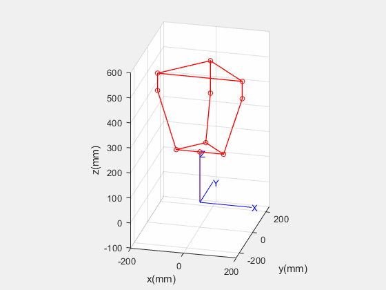
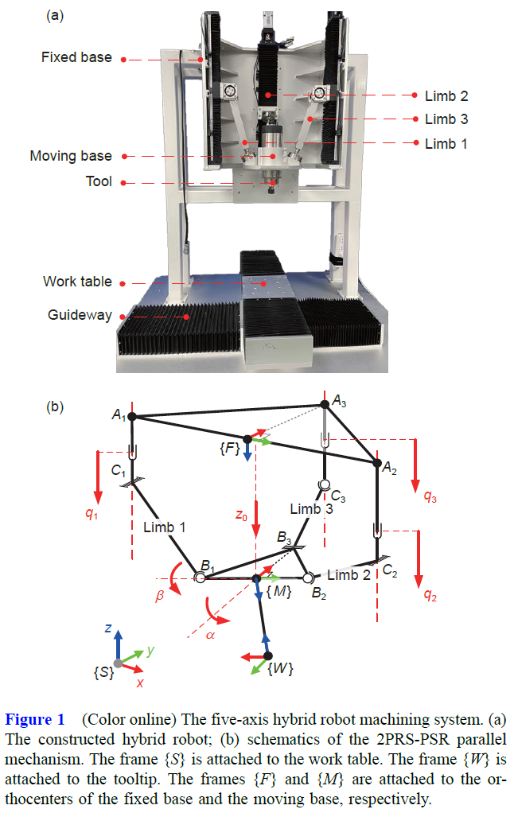

# Introduction

This is a kinematics demo for a 2PRSPSR hybrid robot built with MATLAB. 

# Usage

1. Add all the folders and sub-folders to the path. 

2. Run `demo.m`. 

# Result

# Notations

# Reference

The notation about the kinematics is defined in the paper. 

ZiKang SHI, WeiJia ZHANG, Ye DING, A local toolpath smoothing method for a five-axis hybrid machining robot,  SCIENCE CHINA Technological Sciences, -, ISSN 1674-7321, https://doi.org/10.1007/s11431-022-2315-7.
(http://www.sciengine.com/doi/10.1007/s11431-022-2315-7)

Keywords: hybrid robot; toolpath smoothing; B-spline; five-axis machining; trajectory generation; 
